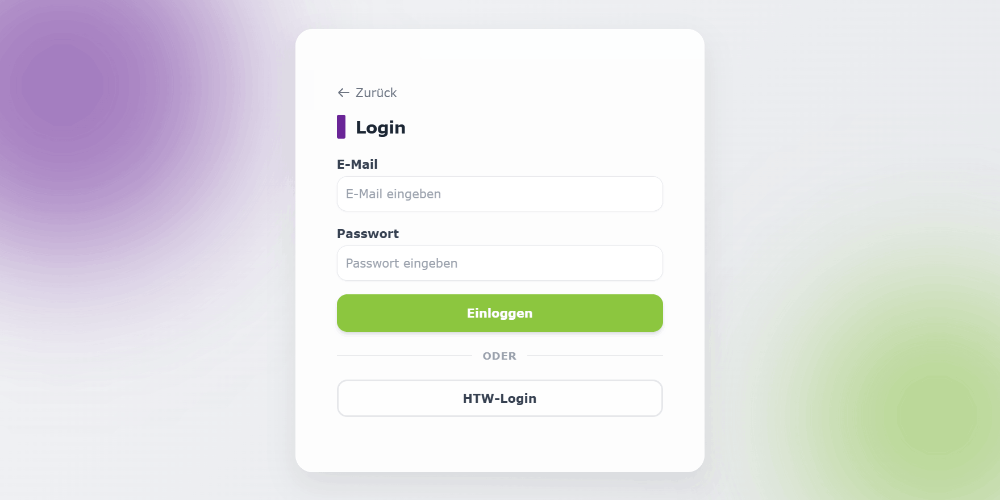
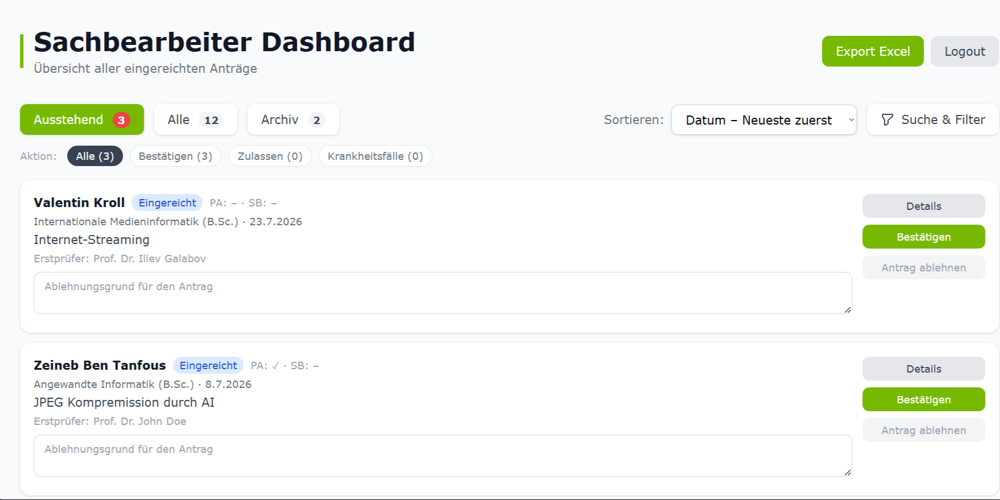

+++
project_id = "B5"
# Durch die Leerzeichen kann der Browser den Text am Bildschirmrand sauber umbrechen
title = "Thesis Manager"

# subtitle erscheint auf Übersichtsseite und Projektseite direkt unter dem Titel.
subtitle = "Das digitale Abschlussarbeits-Managementsystem der HTW"

# der claim oder auch teaser erscheint auf Übersichtsseite und Projektseite nach Titel und Subtitle
claim = "Abschlussarbeit leicht gemacht: Ein zentrales System, das Studierende, Lehrende, den Prüfungsausschuss und die Verwaltung digital verbindet von der Anmeldung bis zum Kolloquium."

# Abstract - KANN WEGGELASSEN WERDEN
abstract = ""

# Hier wieder das korrekte Logo eintragen!
card_image = "b5logofinal.jpg"

# Names are optional, team size is sufficient
team = ["Maliha Haque", "Valentin Kroll", "Orkun Öztürk", "Lloyd Sydney Ball", "Mohammed Al Ali"]

supervisor = "Prof. Dr. Gefei Zhang"
draft = false

source_link = "https://gitlab.rz.htw-berlin.de/s0594623/b5"
demo_link = ""
website_link = "https://b5.f4.htw-berlin.de"
+++


An Abschlussarbeiten kommt man nicht vorbei. Sie sind der Weg zum Ziel, aber oft auch der Grund für großes Kopfzerbrechen. Egal ob Studierende, die den Antrag stellen, die Prüfenden, die betreuen, der Prüfungsausschuss, der genehmigt, oder die Verwaltung, die am Ende alle Fäden zusammenhält: Alle haben im Endeffekt dasselbe Ziel. Sie wünschen sich einen einfachen, reibungslosen Verlauf vom Anfang bis zum Ende.

Auf den ersten Blick mag das Thema "Verwaltungssoftware" vielleicht unscheinbar wirken. Für uns stand dahinter jedoch ein reales, greifbares Problem aus unserem eigenen Hochschulalltag, für das wir einen echten, funktionierenden Lösungsansatz entwickeln wollten. In einer so digitalen Welt hat das zentrale Bindeglied gefehlt. Genau hier kommt unser **Thesis Manager** ins Spiel: Eine übersichtliche, transparente Anwendung, die das analoge Chaos beendet und alle Beteiligten auf einer einzigen Plattform vernetzt.



Um das komplexe Zusammenspiel der verschiedenen Akteure abzubilden, haben wir uns für eine moderne und übersichtliche Architektur entschieden. 

## Verwendeter Tech-Stack

  
  
  
  
  

* **Frontend:** Vue 3, Vue Router, Tailwind CSS, Vite, SheetJS (für den Excel-Datenexport) und jsPDF (für die dynamische PDF-Erstellung).
* **Backend:** PocketBase mit OIDC / OAuth2 zur sicheren Authentifizierung über den HTW-Account.
* **Infrastruktur & Deployment:** Das Projekt ist vollständig mit Docker containerisiert. Über eine automatisierte GitLab CI/CD-Pipeline wird bei jedem Push direkt auf eine virtuelle Maschine (VM) der HTW Berlin deployed.

Während der Entwicklung haben wir die administrativen Prozesse nicht nur digitalisiert, sondern kontinuierlich hinterfragt und optimiert.

## Das Ergebnis
Entstanden ist der Thesis Manager: Eine responsive Single-Page-Anwendung, die alle Rollen durch einen integrierten Workflow führt und stets einen klaren Überblick über den Status der Arbeiten bietet.

Unsere Kernfunktionen im Überblick:
* **Single Sign-On (SSO) & Smartes Routing:** Bequemer Login über den HTW-Account. Eine intelligente Logik im Hintergrund erkennt automatisch die Rolle (Studierende, Prüfende, Prüfungsausschuss, Verwaltung) und leitet direkt zum passgenauen Dashboard weiter.
* **Zielgruppenspezifische Dashboards:** Übersichtliche Card-Layouts ersetzen endlose Tabellen. Studierende sehen den Live-Status ihrer Anträge, Prüfende verwalten Betreuungsanfragen, der Prüfungsausschuss filtert offene Anträge und die Verwaltung hat Zugriff auf ein strukturiertes Archiv.
* **Automatisierte Kommunikation:** Das System benachrichtigt zuständige Personen bei Statusänderungen oder neuen Anfragen automatisch per E-Mail.
* **Integrierte PDF- & Excel-Funktionen:** Ausgefüllte Formulare und Kolloquiumsprotokolle werden dynamisch als PDFs generiert. Zudem können Antragsdaten von der Verwaltung unkompliziert als Excel-Datei exportiert werden.

## Einblicke in die Anwendung

**1. Der Login-Bereich**

Sicherer Einstieg via HTW-Login oder E-Mail

**2. Das Dashboard für die Verwaltung / Sachbearbeiter**

Übersicht aller Anträge mit Excel-Export und Filterfunktionen



**Our wonderful Team of 5**











Danke an Professor Zhang für die tolle Betreuung, die wöchentlichen Meetings, das strikte aber gute Feedback durch die wir wirklich gut in den Arbeitsflow gekommen sind, und an die schönen Momente und Gespräche mit dem Team!
